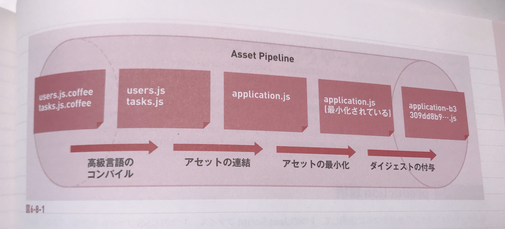

## 目次

1. アセットパイプラインとは
2. ブラウザにアセットを読み込ませる
3. 連結結果のファイルをどうやって生成するか


## 1.アセットパイプラインとは

開発者が書いたJavaScriptやCSSを最終的にアプリを使う上で都合の良い状態(ブラウザが読み取れる形式で、実行速度が速く、ブラウザキャッシュに対して最適化される)にするための
パイプライン処理を行います。図にすると次のようになる。




- 高級言語のコンパイル
SCSS,ERB,Slim等で記述されたコードをコンパイルして、ブラウザが認識できるJavaScript,CSSファイルとして扱います。

- アセットの連結
複数のJavaScript,CSSファイルを一つのファイルに連結することで読み込みに必要となるリクエスト数を減らし、全ての読み込みが終わるまでの時間を短縮します。

- アセットの最小化
スペース、改行、コメントを削除してファイルを最小化し、通信量を節約します

- ダイジェストの付与
コードの内容からハッシュ値を算出して、ファイル名の末尾に付与します。このようにすると、コードが変更されればファイル名が変更されるため、ブラウザのキャッシュの影響で修正が反映されないという問題を防ぐことができます・


## 2.ブラウザにアセットを読み込ませる

CSSやJavaScriptなどのアセットは、通常,Web画面にアクセスしたブラウザが、サーバーから返されたHTML内にある、scriptタグ、linkタグなどのリンク情報を読み取ることによって読み込まれ、利用できるようになる。このようなリンク情報をRailsではどのように実装するのだろう・


<br>
<br>
Railsでは、CSSを読み込むには stylesheet_link_tag ,JavaScriptを読み込むには javascript_include_tag というヘルパーメソッドを使います。
どちらも、第一引数に読み込みたいアセットファイルを指定します。<br>
複数のファイルを列挙したり、オプションを指定することもできます。

```rails

= stylesheet_link_tag  'application', media: 'all', 'data-turbolinks-track': 'reload'
= javascript_include_tag 'application', 'data-turbolinks-track': 'reload'

```

ここで読み込まれてる、application.cssとapplication.js はなんなのでしょうか？<br>
これらはアセットパイプラインによって結合された結果のファイルです。


## 3.連結結果のファイルをどうやって生成するか

ファイルをどんなふうに連結して出力するかは、プログラマが app/assets/application.css や app/assets/application.js といった「マニフェストファイル」に記述します。


上記の図のように、CSSやJavaScriptをそれぞれapplication.css, application.jsとして一つに連結するのがRailsのデフォルトのやり方ですが、自由に変えることもできます。例えば、admin.cssとuser.cssのふたつのCSSファイルヲアセットパイプラインによって生成し、各ページでは必要に応じてinludeするといった形にすることできます。


