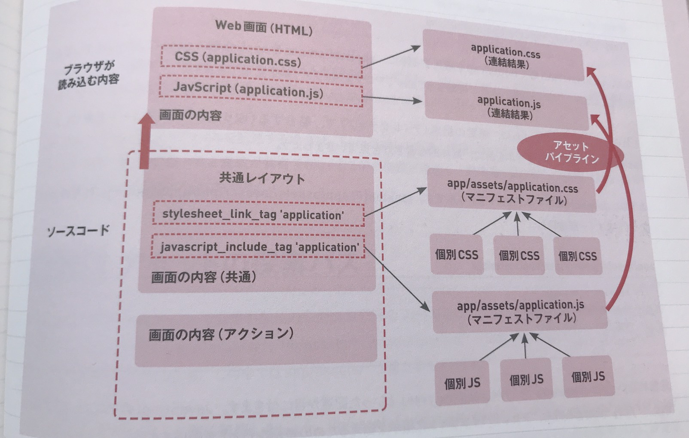

## 目次

1. アセットパイプラインとは
2. ブラウザにアセットを読み込ませる
3. 連結結果のファイルをどうやって生成するか
4. マニフェストファイルを記述する
5. アセットの探索パス


## 1.アセットパイプラインとは

開発者が書いたJavaScriptやCSSを最終的にアプリを使う上で都合の良い状態(ブラウザが読み取れる形式で、実行速度が速く、ブラウザキャッシュに対して最適化される)にするための
パイプライン処理を行います。図にすると次のようになる。


- 高級言語のコンパイル
SCSS,ERB,Slim等で記述されたコードをコンパイルして、ブラウザが認識できるJavaScript,CSSファイルとして扱います。

- アセットの連結
複数のJavaScript,CSSファイルを一つのファイルに連結することで読み込みに必要となるリクエスト数を減らし、全ての読み込みが終わるまでの時間を短縮します。

- アセットの最小化
スペース、改行、コメントを削除してファイルを最小化し、通信量を節約します

- ダイジェストの付与
コードの内容からハッシュ値を算出して、ファイル名の末尾に付与します。このようにすると、コードが変更されればファイル名が変更されるため、ブラウザのキャッシュの影響で修正が反映されないという問題を防ぐことができます・


## 2.ブラウザにアセットを読み込ませる

CSSやJavaScriptなどのアセットは、通常,Web画面にアクセスしたブラウザが、サーバーから返されたHTML内にある、scriptタグ、linkタグなどのリンク情報を読み取ることによって読み込まれ、利用できるようになる。このようなリンク情報をRailsではどのように実装するのだろう・


<br>
<br>
Railsでは、CSSを読み込むには stylesheet_link_tag ,JavaScriptを読み込むには javascript_include_tag というヘルパーメソッドを使います。
どちらも、第一引数に読み込みたいアセットファイルを指定します。<br>
複数のファイルを列挙したり、オプションを指定することもできます。

```rails

= stylesheet_link_tag  'application', media: 'all', 'data-turbolinks-track': 'reload'
= javascript_include_tag 'application', 'data-turbolinks-track': 'reload'

```

ここで読み込まれてる、application.cssとapplication.js はなんなのでしょうか？<br>
これらはアセットパイプラインによって結合された結果のファイルです。


## 3.連結結果のファイルをどうやって生成するか

ファイルをどんなふうに連結して出力するかは、プログラマが app/assets/application.css や app/assets/application.js といった「マニフェストファイル」に記述します。





上記の図のように、CSSやJavaScriptをそれぞれapplication.css, application.jsとして一つに連結するのがRailsのデフォルトのやり方ですが、自由に変えることもできます。例えば、admin.cssとuser.cssのふたつのCSSファイルヲアセットパイプラインによって生成し、各ページでは必要に応じてinludeするといった形にすることできます。

<br>
<br>


## 4.マニフェストファイルを記述する

<br>
<br>


アセットパイプラインの結合の機能を利用するためには、具体的にソースコード同士を連結させるのかを決め。アセットパイプラインに伝えてやる必要があります。<br>
これはマニフェストファイルを記述することによって行います <br>


<br>
<br>

これらのマニフェストファイルに、特定の記法(ディレクティブ)で、結合する(取り込む)ソースコードを指定します。


JavaScriptのマニフェストファイル。
app/assets/javascript/application.js ⬇︎

```javascript
//= require rails-ujs
//= require activestorage
//= require turbolinks
//= require_tree .
```


「//= require」や「//= require_tree」といった記述が目に付く。JavaScriptのマニフェストファイルでは、「//=」で始まる行を、アセットパイプラインに指示を伝えるための特別な業として扱います。<br>
* ファイルがJavaScriptファイルとして有効になるように、Sprockets独自の仕様であるディレクティブはJavaScriptのコメントの一種として設計されています。

<a href="https://github.com/rails/sprockets#directives">SprocketsのGithubページ</a>他にも様々なディレクティブがある


<br>
<br>


ここまでJavaScriptについて説明してきたが、CSSも考え方は同じ。ただし、ディレクティブを記述する方法が異なります。<br>
cssをSassで書くように置き換えてる場合はSassの@importを利用して記述していきます。

app/assets/stylesheets/application.scss
```
@import "bootstarp";
@import "tasks";
```


## 5.アセットの探索パス


マニフェストで指定するJavaScriptやCSSのファイル名は、アセットの探索パスの設定をもとに引き当てられます。<br>
デフォルトでは app/assets, lib/assets/ , vendor/assets/ が探索パスに設定されています。<br>
探索はパスの出現順で行われるため、app/assets/* がもっとも優先されます。
<br>
<br>

JavaScriptのマニフェストを例に説明しましょう。<br>
lib/assets/javascripts/slider.js , vendor/assets/javascripts/modal.js といったファイルを新たに取り込みたい時、 lib/assetsと vendor/assetsはそれぞれ探索パスに設定されているので、マニフェストファイルに以下の行を追記するだけで済む。

application.js (マニフェストファイル)

```
//= require slider
//= require modal
```

デフォルトの探索パスに加えて、他のディレクトリも探索パスとして設定したいこともあるでしょう。それには、Rails.application.config.assets.paths に探索パスを追加します。この設定は 通常 config/initializers/assets.rb の中で記述します。この設定は通常 config/initializers/assets.rb の中で記述します。ファイルを開いてみると、すでにnode_modulesが追加済みとなっていることがわかる。


```
# Add Yarn node_modules folder to the asset load path.
Rails.application.config.assets.paths << Rails.root.join('node_modules')
```


## 勉強になりそうな資料

- [ ] <a href="https://railsguides.jp/asset_pipeline.html#%E3%83%9E%E3%83%8B%E3%83%95%E3%82%A7%E3%82%B9%E3%83%88%E3%83%95%E3%82%A1%E3%82%A4%E3%83%AB%E3%81%A8%E3%83%87%E3%82%A3%E3%83%AC%E3%82%AF%E3%83%86%E3%82%A3%E3%83%96">rails tutorial</a>


